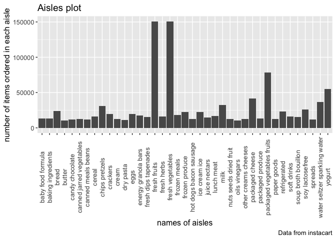

p8105\_hw3\_xh2395
================
Xin He
10/12/2019

## Problem 1

**How many aisles are there?**

``` r
instacart%>%
  group_by(aisle) %>%
  summarize(n_of_aisle = n())
```

    ## # A tibble: 134 x 2
    ##    aisle                  n_of_aisle
    ##    <chr>                       <int>
    ##  1 air fresheners candles       1067
    ##  2 asian foods                  7007
    ##  3 baby accessories              306
    ##  4 baby bath body care           328
    ##  5 baby food formula           13198
    ##  6 bakery desserts              1501
    ##  7 baking ingredients          13088
    ##  8 baking supplies decor        1094
    ##  9 beauty                        287
    ## 10 beers coolers                1839
    ## # … with 124 more rows

There are 134 aisels.

**Which aisles are the most items ordered from?**

``` r
instacart%>%
  group_by(aisle) %>%
  summarize(n_of_aisle = n()) %>% 
  filter(min_rank(desc(n_of_aisle)) < 2)
```

    ## # A tibble: 1 x 2
    ##   aisle            n_of_aisle
    ##   <chr>                 <int>
    ## 1 fresh vegetables     150609

The most items are ordered from fresh vegetables. The items in fresh
vegetables are ordered 150609 times.

**Plot that shows the number of items ordered in each aisle**

``` r
instacart%>%
  group_by(aisle) %>%
  summarize(n_of_aisle = n()) %>% 
  filter(n_of_aisle > 10000) %>% 
  ggplot(aes(x = aisle, y = n_of_aisle)) + 
  geom_bar(stat="identity") +
  theme(text = element_text(size=12),
         axis.text.x = element_text(angle=90, vjust=0.5)) +
  labs(
    title = "Aisles plot",
    x = "names of aisles",
    y = "number of items ordered in each aisle",
    caption = "Data from instacart")
```

<!-- --> In
the plot, there are 39 aisles that are with more than 10000 items
ordered. X asix is the names of different aisles. Y asix is the number
of items ordered in each aisle,and 50000 is used as each break.

**Make a table showing the three most popular items in each of the
aisles “baking ingredients”, “dog food care”, and “packaged vegetables
fruits”**

``` r
instacart%>%
  filter(aisle == c("baking ingredients", "dog food care", "packaged vegetables fruits")) %>%
  group_by(aisle, product_name) %>%
  summarize(n_aisle_product = n()) %>% 
  filter(min_rank(desc(n_aisle_product)) < 4) %>% 
  knitr::kable(digits = 0)
```

| aisle                      | product\_name                                   | n\_aisle\_product |
| :------------------------- | :---------------------------------------------- | ----------------: |
| baking ingredients         | Light Brown Sugar                               |               157 |
| baking ingredients         | Organic Vanilla Extract                         |               122 |
| baking ingredients         | Pure Baking Soda                                |               140 |
| dog food care              | Organix Chicken & Brown Rice Recipe             |                13 |
| dog food care              | Organix Grain Free Chicken & Vegetable Dog Food |                14 |
| dog food care              | Original Dry Dog                                |                 9 |
| packaged vegetables fruits | Organic Baby Spinach                            |              3324 |
| packaged vegetables fruits | Organic Blueberries                             |              1692 |
| packaged vegetables fruits | Organic Raspberries                             |              1920 |

As shown in the table, in the aisle “baking ingredients”, the three most
popular items are “Light Brown Sugar”, “Organic Vanilla Extract” and
“Pure Baking Soda”; in the aisle “dog food care”, the three most
popular items are “Organix Chicken & Brown Rice Recipe”, “Organix Grain
Free Chicken & Vegetable Dog Food” and “Original Dry Dog”; in the aisle
“packaged vegetables fruits”, the three most popular items are
“Organic Baby Spinach”, “Organic Blueberries” and “Organic
Raspberries”.

**Make a table showing the mean hour of the day at which Pink Lady
Apples and Coffee Ice Cream are ordered on each day of the week**

``` r
instacart%>%
  filter(product_name %in% c("Pink Lady Apples", "Coffee Ice Cream")) %>%
  group_by(product_name,order_dow) %>%
  summarize(mean_order_hour = mean(order_hour_of_day)) %>% 
  pivot_wider(
    names_from = order_dow,
    values_from = mean_order_hour) %>% 
  rename(Sunday = "0", Monday = "1", Tuesday = "2", Wednesday = "3", Thursday = "4", Friday = "5", Saturday = "6") %>% 
  knitr::kable(digits = 1)
```

| product\_name    | Sunday | Monday | Tuesday | Wednesday | Thursday | Friday | Saturday |
| :--------------- | -----: | -----: | ------: | --------: | -------: | -----: | -------: |
| Coffee Ice Cream |   13.8 |   14.3 |    15.4 |      15.3 |     15.2 |   12.3 |     13.8 |
| Pink Lady Apples |   13.4 |   11.4 |    11.7 |      14.2 |     11.6 |   12.8 |     11.9 |

As shown in the table, the mean order hour of Coffee Ice Cream on
Tuesday is the latest (15.4) and the mean order hour of Pink Lady Apples
on Wednesday is the latest (14.2).

The dataset “instacart”, has 1384617 observations and 15 columns. Key
variables include order\_dow, order\_hour\_of\_day, product\_name and
aisle. Ice cream is ordered later than apples.
